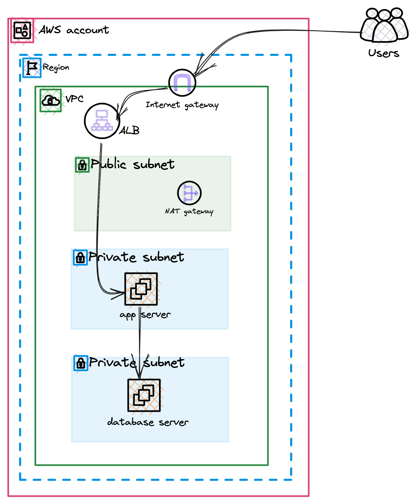

# two tier application using terraform
This is a Terraform boilerplate for setting up a very basic and fundamental two tier application using ec2 instances for the application and database hosting. This creates a VPC and its related resources for the successful deployment of the application. IAM roles are also created to facilitate this.

## Architecture & Design


## Features
- VPC 
- Route Tables, Public and Private Subnets 
- Internet Gateway
- NAT Gateway
- IAM Roles
- Security Groups
- EC2 instances
- Target Groups
- Load balancer
The configuration is designed to be easily customizable and extensible, allowing you to build on top of it to fit your specific needs.

## Prerequisites
- AWS Account
- Terraform installed
- AWS CLI


## Getting started

1. Clone the repository:
   ```sh
   git clone https://github.com/Sarkodie88/two-tier-application-ec2-terraform.git
   ```
2. Initialize terraform
   ```sh
   terraform init
   ```
3. Edit the var_parameters.tfvars file with your desired values.

4.  Verification of the configuration
    ```sh
    terraform plan -var-file=var_parameters.tfvars
    ```
5. Deploy
    ```sh
    terraform apply -var-file=var_parameters.tfvars
    ```
6. Destroy
    ```sh
    terraform destroy -var-file=var_parameters.tfvars
    ```

## Enhancements
The following modifications can be done to enhance the architectural design we currently have:
- Use an Auto Scaling Group to create the instances for high availability.
- Replace database instance with an RDS instance or AURORA DB.


## Contributing
If you'd like to contribute to this project, please fork the repository and make the desired changes. Then, submit a pull request for review.